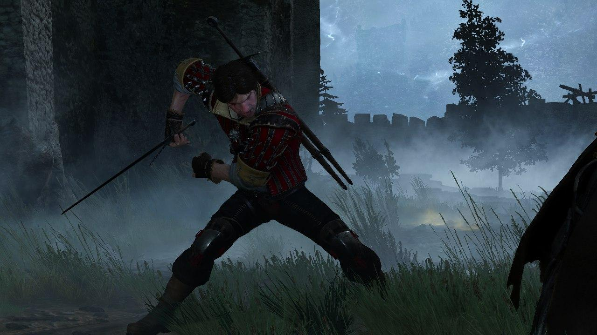
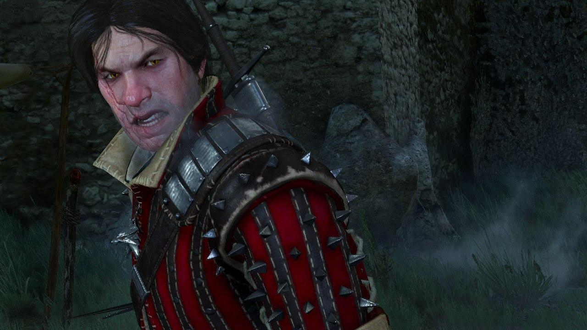

# Eskel

Eskel was a witcher of the School of the Wolf taught by Master Vesemir at Kaer Morhen and active in the 13th century. 
As the sorceress Triss Merigold noticed, Eskel emanated a strong magic aura. 
Though less famous than his peer Geralt of Rivia, Eskel became renowned in his own right as a professional, 
reliable witcher, and possessing a kind and relaxed disposition.

Eskel and the White Wolf were like brothers. 
Side by side they grew up, enjoyed pastime activities and endured the witcher trials. 
A good friend of younger Lambert and Coën of Poviss, Eskel saw Vesemir as both a mentor and a father figure. 
He returned to Kaer Morhen each winter to swap tales and rejuvenate for The Path.

## Charcter and Traits

* calm, patient, stable
* thoughtful
* polite
* reliable
* has a a long, hideous, semi-circular scar running from the corner of his mouth across the length of his cheek up to the ear
    * that doesn't stop him from smiling
    * gets itchy when he is nervous or embarrassed
* Minus the scar and hair color, Eskel and Geralt resemble one another like true brothers.
* Eskel's hands emanate powerfully with magic, with more power than the White Wolf's.
* On festive occasions, he would sport a beret adorned with pheasant feathers.

> _"And the lord barons and village elders have their heads full of the war and don't have the time to defend their subjects.
> They have to hire us. It's true. But from what Triss has been telling us all these evenings,
> it seems the conflict with Nilfgaard is more serious than that, not just some local little war."_
> 
> pg. 57, Blood of Elves (UK edition)

